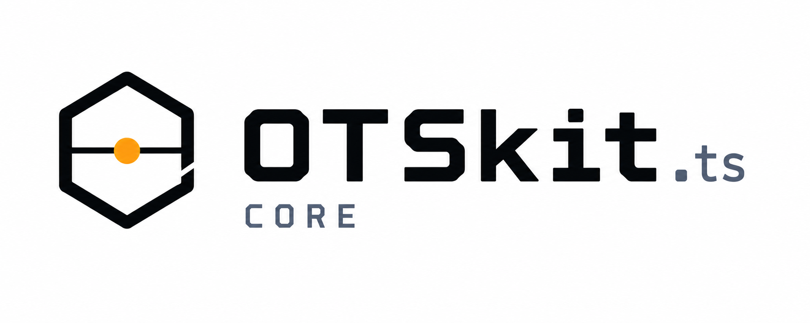

<p align="center">
  
</p>

# @otskit/core

[](https://github.com/OTSkit/OTSkit-core/actions/workflows/ci.yml)
[](https://github.com/OTSkit/OTSkit-core/actions/workflows/codeql.yml)
[](https://www.npmjs.com/package/@otskit/core)
[](https://www.npmjs.com/package/@otskit/core)
[](https://www.typescriptlang.org/)
[](https://nodejs.org)
[](https://codecov.io/gh/OTSkit/OTSkit-core)
[](https://sonarcloud.io/summary/new_code?id=OTSkit_OTSkit-core)
[](LICENSE)

OpenTimestamps core library — TypeScript, zero-dependency, fail-closed.

The next generation of [`@alexalves87/opentimestamps`](https://www.npmjs.com/package/@alexalves87/opentimestamps), rewritten from the ground up with TypeScript 6 strict mode, zero external dependencies, and a fail-closed security posture.

---

## What is OpenTimestamps?

[OpenTimestamps](https://opentimestamps.org) is an open standard for decentralized timestamp proofs. It lets you prove that a document existed at a specific point in time by anchoring its cryptographic hash into the Bitcoin (or Litecoin) blockchain. The proof is stored in a compact `.ots` file — no trusted third party required for verification, ever.

## Features

- **Zero dependencies** — pure TypeScript implementation, no npm supply chain risk
- **Fail-closed by design** — strict input validation; rejects `ArrayBuffer`, `Buffer`, and any malformed input by default
- **TypeScript-first** — full type declarations, TypeScript 6 strict mode, ESM + CJS dual build
- **Complete protocol** — create, serialize, deserialize, merge, and verify timestamps
- **Merkle tree support** — batch-timestamp thousands of documents in a single blockchain transaction
- **Pure crypto** — built-in SHA1, SHA256, and RIPEMD-160 with no native bindings

## Installation

```bash
npm install @otskit/core
```

Requires Node.js ≥ 20.

---

> **Note on confirmation times:** After submitting a timestamp, the `.ots` proof starts as `pending` — it references a calendar server but has no blockchain attestation yet. Bitcoin confirmations typically arrive within **~60 minutes**, but can take **several hours** during network congestion. A pending proof is not a failed proof.

---

## Quick Start

### Timestamp a file

```typescript
import { DetachedTimestampFile, OpSHA256, makePending } from '@otskit/core';
import { readFileSync, writeFileSync } from 'node:fs';

// Hash your file and wrap it in a detached timestamp
const fileContent = new Uint8Array(readFileSync('document.pdf'));
const dtf = DetachedTimestampFile.fromBytes(new OpSHA256(), fileContent);

// Register with an OpenTimestamps calendar (pending — will be upgraded to Bitcoin)
dtf.timestamp.attestations.push(
  makePending('https://alice.btc.calendar.opentimestamps.org'),
);

// Save the .ots proof file alongside the original document
writeFileSync('document.pdf.ots', dtf.serializeToBytes());
```

### Read a .ots file

```typescript
import { DetachedTimestampFile } from '@otskit/core';
import { readFileSync } from 'node:fs';

const otsBytes = new Uint8Array(readFileSync('document.pdf.ots'));
const dtf = DetachedTimestampFile.deserialize(otsBytes);

console.log('Hash algorithm:', dtf.fileHashOp.tagName);
console.log('File digest:   ', Buffer.from(dtf.fileDigest()).toString('hex'));
console.log('Complete:      ', dtf.timestamp.isTimestampComplete());
console.log('Attestations:  ', dtf.timestamp.getAttestations());
```

### Verify against a Bitcoin block header

```typescript
import { DetachedTimestampFile, verifyAgainstBlockheader } from '@otskit/core';
import { readFileSync } from 'node:fs';

const dtf = DetachedTimestampFile.deserialize(
  new Uint8Array(readFileSync('document.pdf.ots')),
);

// Retrieve the block header from a full node or trusted block explorer
for (const { msg, attestation } of dtf.timestamp.allAttestations()) {
  if (attestation.kind === 'bitcoin') {
    verifyAgainstBlockheader(msg, blockHeader); // throws VerificationError if invalid
    console.log(`Verified at Bitcoin block height ${attestation.height}`);
  }
}
```

### Batch-timestamp with a Merkle tree

Anchor thousands of documents in a single blockchain transaction:

```typescript
import { DetachedTimestampFile, OpSHA256, makeMerkleTree, makePending } from '@otskit/core';
import { readFileSync, writeFileSync } from 'node:fs';

const files = ['a.pdf', 'b.pdf', 'c.pdf'];
const op = new OpSHA256();

const dtfs = files.map(f =>
  DetachedTimestampFile.fromBytes(op, new Uint8Array(readFileSync(f))),
);

// One Merkle root covers all documents — one calendar call, one blockchain entry
const root = makeMerkleTree(dtfs.map(d => d.timestamp));
root.attestations.push(makePending('https://alice.btc.calendar.opentimestamps.org'));

// Each .ots file carries its own path to the shared root
files.forEach((f, i) => writeFileSync(`${f}.ots`, dtfs[i]!.serializeToBytes()));
```

---

## API Reference

### `DetachedTimestampFile`

Immutable wrapper for a `.ots` proof file.

| Member | Description |
|--------|-------------|
| `DetachedTimestampFile.fromBytes(op, content)` | Create from raw file bytes |
| `DetachedTimestampFile.fromHash(op, digest)` | Create from a pre-computed digest |
| `DetachedTimestampFile.deserialize(bytes)` | Parse a `.ots` file (`Uint8Array` only — fail-closed) |
| `.serializeToBytes()` | Serialize back to `.ots` bytes |
| `.fileDigest()` | The file's hash as `Uint8Array` (defensive copy) |
| `.fileHashOp` | The `CryptOp` used to hash the file |
| `.timestamp` | The root `Timestamp` of the proof tree |

### `Timestamp`

A node in the proof tree. Each node holds a digest (`msg`), direct attestations, and operation branches leading to sub-timestamps.

| Member | Description |
|--------|-------------|
| `new Timestamp(msg)` | Create a new leaf node |
| `.add(op)` | Apply an operation and return (or reuse) the sub-timestamp |
| `.addExisting(op, stamp)` | Cross-link to an existing timestamp (used internally by Merkle) |
| `.merge(other)` | Absorb attestations and branches from another timestamp with the same `msg` |
| `.attestations` | Direct `Attestation[]` — push to add seals to this node |
| `.getDigest()` | Defensive copy of `msg` |
| `.getAttestations()` | All attestations anywhere in the tree |
| `.allAttestations()` | All `{ msg, attestation }` pairs in the tree |
| `.isTimestampComplete()` | `true` if a Bitcoin or Litecoin attestation exists |
| `.allTips()` | The leaf digests (nodes with no operations) |
| `.equals(other)` | Deep structural equality |

### Operations

All operations extend `Op` and are serializable. Binary ops (`OpAppend`, `OpPrepend`) take a `Uint8Array` argument in their constructor.

| Class | Tag | Description |
|-------|-----|-------------|
| `OpSHA256` | `0x08` | SHA-256 hash |
| `OpSHA1` | `0x02` | SHA-1 hash |
| `OpRIPEMD160` | `0x03` | RIPEMD-160 hash |
| `OpAppend(suffix)` | `0xf0` | Append bytes |
| `OpPrepend(prefix)` | `0xf1` | Prepend bytes |
| `OpReverse` | `0xf2` | Reverse byte order |
| `OpHexlify` | `0xf3` | Encode to ASCII hex |

### Attestations

| Function | Description |
|----------|-------------|
| `makePending(uri)` | Pending calendar attestation — proof not yet upgraded to blockchain |
| `makeBitcoin(height)` | Bitcoin blockchain attestation at block `height` |
| `makeLitecoin(height)` | Litecoin blockchain attestation at block `height` |
| `verifyAgainstBlockheader(digest, header)` | Verify a 32-byte digest against a block's Merkle root — throws `VerificationError` on failure |

### Merkle tree

| Function | Description |
|----------|-------------|
| `makeMerkleTree(timestamps)` | Build a Merkle-Mountain-Range from an array of timestamps. Returns the root. Throws `EmptyMerkleTreeError` on empty input. |

### Serialization contexts

For low-level binary I/O following the OpenTimestamps wire format (LEB128 varints, length-prefixed bytes):

| Class | Description |
|-------|-------------|
| `StreamSerializationContext` | Write binary data; call `.getOutput()` for the result |
| `StreamDeserializationContext` | Read binary data with bounds checking and EOF enforcement |

### Utilities

| Function | Description |
|----------|-------------|
| `hexToBytes(hex)` | Hex string → `Uint8Array` |
| `bytesToHex(bytes)` | `Uint8Array` → lowercase hex string |
| `textToBytes(text)` | UTF-8 string → `Uint8Array` |
| `bytesToText(bytes)` | `Uint8Array` → UTF-8 string (throws on invalid sequences) |
| `randBytes(n)` | Cryptographically secure random bytes via `crypto.getRandomValues` — throws if unavailable |

### Errors

All error classes extend `Error` and are exported by name for precise `catch` handling.

| Category | Error classes |
|----------|--------------|
| Deserialization | `DeserializationError`, `BadMagicError`, `TruncatedStreamError`, `OversizedDataError`, `VaruintOverflowError`, `TrailingGarbageError`, `UnknownOperationError`, `InvalidUriError`, `UnsupportedVersionError` |
| Operation | `OpExecutionError`, `MessageTooLongError`, `ResultTooLongError` |
| Verification | `VerificationError` |
| Tree | `EmptyTimestampError`, `MergeError`, `EmptyMerkleTreeError` |

---

## Contributing

```bash
git clone https://github.com/OTSkit/OTSkit-core.git
cd OTSkit-core
npm install
npm test           # run the full test suite
npm run build      # ESM + CJS + TypeScript declarations
npm run coverage   # test coverage report
```

All contributions must preserve the fail-closed philosophy: strict input validation at every boundary, no silent failures, no implicit type coercion.

## License

MIT © OTSkit contributors — see [LICENSE](LICENSE).
